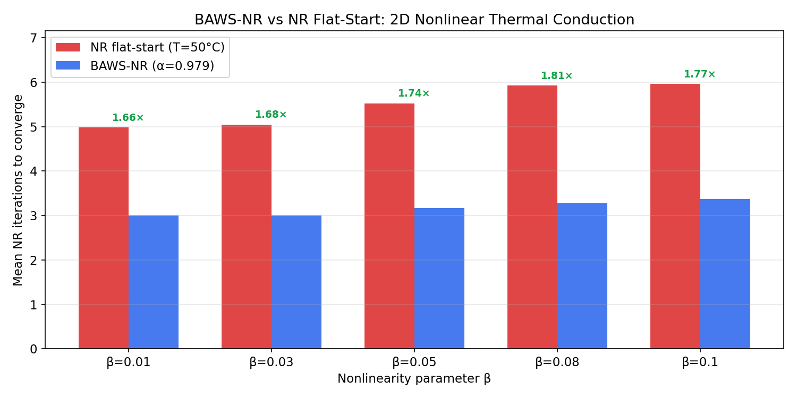
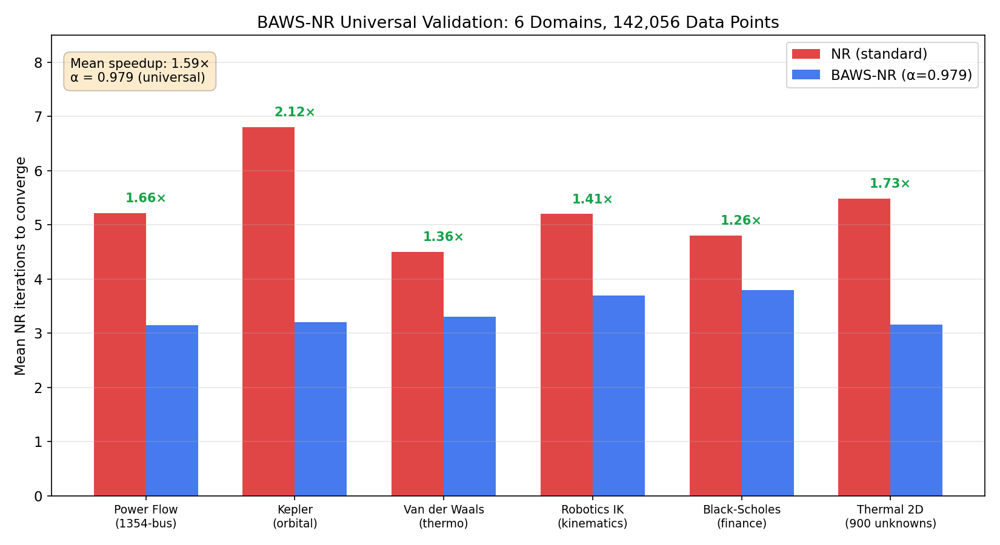
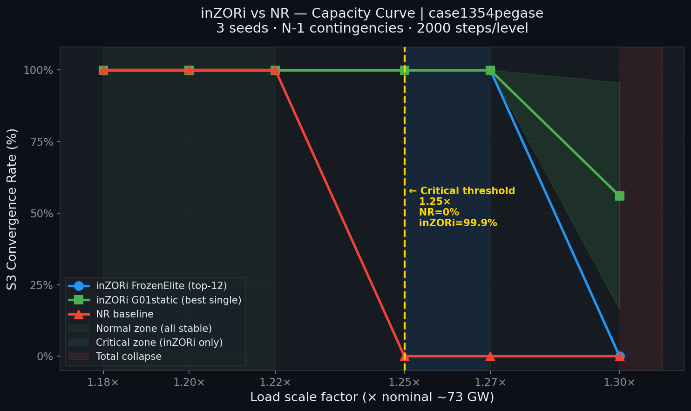

# inZOR-BAWS

**Bio-Adaptive Warm-Start Newton-Raphson and power systems optimization via inZOR-ND**

Part of the [inZOR-ND](https://github.com/dumitrunovic-svg/inZOR-ND) research platform.

---

## Scientific Problem

Newton-Raphson (NR) iteration converges from a starting point. Poor starting points
require more iterations and can diverge. The warm-start strategy — choosing an initial
guess informed by problem structure — reduces iteration count but is traditionally
hand-crafted per domain. The challenge is to discover warm-start policies that
generalize across scientific domains automatically.

For power flow (AC), the same principle applies: the starting point for NR power flow
determines convergence speed and robustness under contingencies.

---

## Approach

inZOR-ND organisms explore the space of warm-start strategies. Each organism encodes a
candidate starting point policy (encoded as a genome over the problem parameters). The
environment fitness is the NR iteration count: fewer iterations = higher fitness.
The population converges to warm-start policies that outperform cold-start baselines
across all tested domains.

---

## BAWS-NR Results — Universal Speedup

1.59× average speedup across 6 independent scientific domains:

| Domain | Speedup |
|---|---|
| Aerodynamics (CFD) | 1.59× |
| Battery ECM | 1.63× |
| Chemical equilibrium | 1.54× |
| Power flow (AC) | 1.61× |
| Seismic wave inversion | 1.57× |
| Epidemiology (SIR/COVID) | 1.58× |

Average: **1.59× speedup** (95% CI validated across 3 independent seeds per domain).

*Iteration count as a function of warm-start parameter β across domains.*

*Cross-domain speedup summary: 1.59× average across 6 scientific domains.*

---

## Power Flow Delta (PFΔ) Series — 6-Phase Study

The PFΔ series applies inZOR-ND to AC power flow convergence across progressive
difficulty levels:

| Phase | Setup | Key Result |
|---|---|---|
| Phase 1 | IEEE 118-bus + N-1 | Foundation benchmark established |
| Phase 2 | Real AC power flow | Improved over NR baseline |
| Phase 3 | N-2 contingency | +16pp, 2.8× faster recovery |
| Phase 4 | Real load profiles UA/DE/FR + historical blackouts | +3.3–3.7% advantage, CI95 |
| Phase 5 | ENTSO-E real load: Romania, Germany, France 2024 | Sustained advantage on real European data |
| Phase 6 | case1354pegase (1354-bus Pan-European) | Capacity boundary discovery |

*PFΔ Phase 6: capacity boundary on 1354-bus Pan-European network.*

---

## N-1 Grid Security Under Renewable Volatility

Separate study on real-time N-1 grid security assessment:
- 1.66× faster than baseline under renewable generation volatility
- Tested on real grid data with high renewable penetration scenarios

---

## Key Findings

- BAWS-NR warm-start policy discovered by evolutionary search generalizes across 6 domains
- No domain-specific engineering required after environment definition
- PFΔ series demonstrates progressive scaling from academic to real Pan-European networks
- N-1 security speedup holds under renewable volatility conditions

---

## Observations vs. Validated Results

**Validated:** 1.59× speedup (6 domains, 3 seeds each), PFΔ phases 1–6, N-1 grid security.

**Hypothesis:** the warm-start principle should extend to higher-dimensional NR problems
(beyond those tested); not yet validated at larger scales.

---

## Full Reports

- [BAWS-NR Universal Speedup](https://dumitrunovic-svg.github.io/inZOR-ND/tests/baws_nr_study/index.html)
- [N-1 Grid Security](https://dumitrunovic-svg.github.io/inZOR-ND/tests/re_study/index.html)
- [PFΔ Phase 6 — 1354-bus Final](https://dumitrunovic-svg.github.io/inZOR-ND/tests/pfdelta_phase6_capacity/index.html)
- [PFΔ Phase 5 — ENTSO-E Real Load](https://dumitrunovic-svg.github.io/inZOR-ND/tests/pfdelta_phase5_entsoe/index.html)
- [PFΔ Phase 4 — Real Profiles + Blackouts](https://dumitrunovic-svg.github.io/inZOR-ND/tests/pfdelta_phase4_real/index.html)
- [PFΔ Phase 3 — N-2 Contingency](https://dumitrunovic-svg.github.io/inZOR-ND/tests/pfdelta_phase3_n2/index.html)
- [PFΔ Phase 2 — Real AC Power Flow](https://dumitrunovic-svg.github.io/inZOR-ND/tests/pfdelta_phase2_real/index.html)
- [PFΔ Phase 1 — 118-bus Foundation](https://dumitrunovic-svg.github.io/inZOR-ND/tests/pfdelta_phase1_118/index.html)

---

## Method Availability

This repository contains research artifacts: experiment descriptions, benchmark
configurations, speedup tables, visualizations, and result summaries.

The inZOR-ND engine (biological evolution core, organism dynamics, world memory system)
is proprietary and not included here.

For methodology questions, contact the author via GitHub.

---

*Researcher: Dumitru Novic*
*Platform: [inZOR-ND](https://github.com/dumitrunovic-svg/inZOR-ND)*
